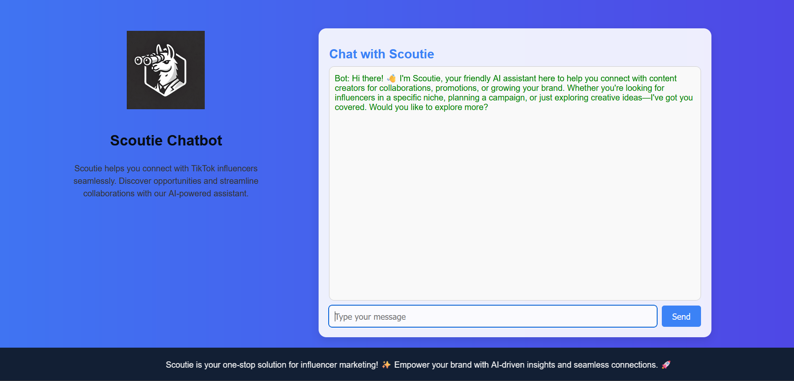

# **Scoutie Chatbot**

Scoutie is a conversational AI-powered assistant designed to connect businesses with TikTok influencers. The project leverages the **Groq API** for keyword generation, the **Apify Client** for TikTok scraping, and processes data into CSV and YAML formats for better insights and reporting.

---

## **Features**

- **Conversational AI:**  
  Interact with Scoutie via a chatbot interface to specify influencer requirements.

- **Keyword Extraction:**  
  Generates relevant keywords for influencer discovery based on user input using the **Groq API**.

- **TikTok Data Scraping:**  
  Retrieves TikTok influencer profiles and metadata using the **Apify Client**.

- **Data Processing:**  
  Processes scraped data into structured CSV and YAML formats with token counting.

- **User-Friendly Interface:**  
  A dynamic web-based UI built with Flask to simplify interactions.

---




## **Folder Structure**

```
Scoutie/
├── app.py                    # Main Flask application
├── process_summary.py        # Script to process summary data
├── requirements.txt          # Python dependencies for the project
├── .env                      # Environment variables (e.g., API keys)
├── static/                   # Static files (CSS, images, JS)
│   ├── css/
│   │   └── styles.css         # Additional CSS styles (if required)
│   ├── images/
│   │   └── logo.webp          # Application logo
│   └── js/
│       └── script.js          # JavaScript (optional for modular scripts)
├── templates/                # HTML templates for Flask
│   └── index.html            # Main chatbot UI
├── data/                     # Data storage directory
│   ├── summary.json          # Summary data
│   ├── tiktok_results.csv    # Scraped TikTok data
│   └── output.yaml           # Converted YAML file
└── README.md                 # Documentation for the project
```

---

## **Setup Instructions**

### **1. Prerequisites**

Ensure you have the following installed:

- Python 3.8+
- Pip (Python package manager)

### **2. Clone the Repository**
```bash
git clone https://github.com/your-repo/scoutie.git
cd scoutie
```

### **3. Create a Virtual Environment**
```bash
python -m venv venv
source venv/bin/activate   # For Linux/macOS
venv\Scripts\activate      # For Windows
```

### **4. Install Dependencies**
```bash
pip install -r requirements.txt
```

### **5. Set Environment Variables**

Create a `.env` file in the project root and add your API keys:
```
GROQ_API_KEY=your_groq_api_key
APIFY_API_TOKEN=your_apify_api_token
```

### **6. Create the Data Directory**
```bash
mkdir data
```

---

## **How to Run**

### **1. Start the Flask Server**
```bash
python app.py
```

The app will run on `http://127.0.0.1:5000/`.

### **2. Interact with the Chatbot**
- Open the URL in your browser to access the chatbot.
- Provide details about the influencers you’re searching for, and Scoutie will generate keywords and scrape TikTok data.

### **3. Process the Summary**
- At the end of a conversation, click the **"Process Summary"** button to scrape TikTok influencer data and generate structured outputs (CSV and YAML).

---

## **Key Endpoints**

### **`/`**
- The home page displaying the chatbot interface.

### **`/chat`**
- Handles user interactions and generates bot responses.

### **`/process-summary`**
- Processes the conversation summary, scrapes TikTok data, and saves the results.

---

## **Processed Outputs**

1. **CSV File:**
   - Located in the `data/` directory as `tiktok_results.csv`.
   - Contains influencer metadata and additional fields extracted from TikTok profiles.

2. **YAML File:**
   - Located in the `data/` directory as `output.yaml`.
   - YAML format of the scraped data with token count.

---

## **Technologies Used**

- **Flask**: Web framework for the chatbot and server.
- **Groq API**: For generating keywords based on user input.
- **Apify Client**: For scraping TikTok influencer data.
- **Pandas**: For data processing and CSV export.
- **PyYAML**: For converting data to YAML format.

---

## **Future Enhancements**

- Add support for additional social media platforms.
- Enhance the chatbot with multilingual support.
- Provide analytics dashboards for influencer insights.

---

## **Contributors**

- **Suman Deb**: Lead Developer  
  Contact: suman8deb@gmail.com

---

## **License**

This project is licensed under the MIT License. See the `LICENSE` file for more details.
